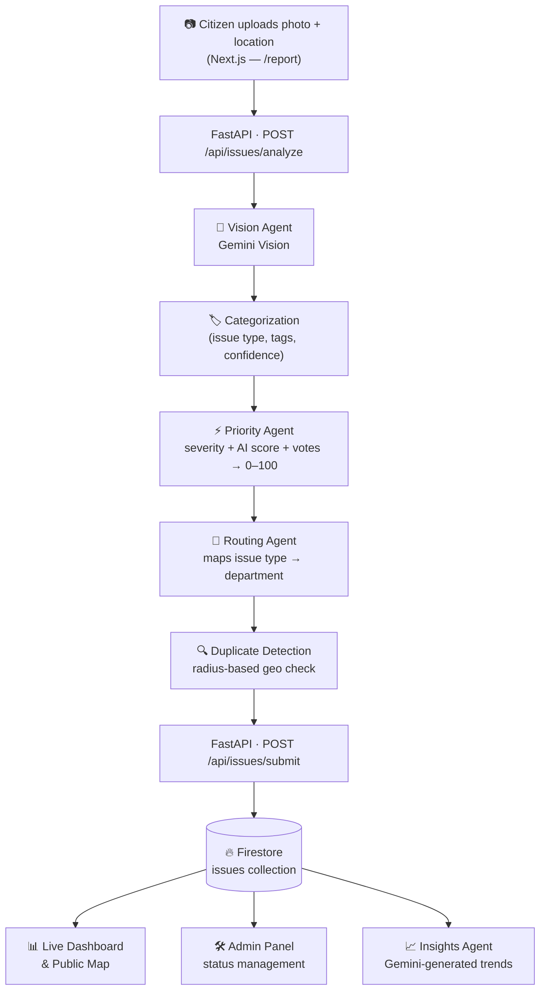

<div align="center">

# 🩺 CivicPulse AI

### Your city, reading its own pulse.

Snap a photo of a pothole, a leak, a broken light — CivicPulse AI sees it, scores it, and routes it to the right department before you've finished typing a report.

[](https://nextjs.org/)
[](https://react.dev/)
[](https://fastapi.tiangolo.com/)
[](https://firebase.google.com/)
[](https://ai.google.dev/)
[](https://www.typescriptlang.org/)
[](https://www.python.org/)
[]()

[Live Demo](#-live-demo) • [Overview](#-overview) • [Features](#-features) • [Architecture](#-system-architecture) • [AI Agents](#-the-ai-agent-pipeline) • [Getting Started](#-getting-started) • [API Reference](#-api-reference) • [Roadmap](#-roadmap)

</div>

<br />

<div align="center">
  
</div>

<br />

## 🌐 Live Demo

**Frontend:** [civicpulse-ow6u.vercel.app](https://civicpulse-ow6u.vercel.app/)

> The AI analysis pipeline runs on a FastAPI backend. The backend is not currently deployed, so AI image analysis is fully functional only when running the backend locally — see [Getting Started](#-getting-started).

<br />

## 📖 Overview

Municipal issue reporting is broken in the same way everywhere: a citizen spots a pothole, opens a clunky form, guesses at a category from a dropdown, writes a vague description, and submits it into a queue with no visible priority and no guarantee it reaches the right desk.

**CivicPulse AI** replaces the form with a camera. A citizen takes one photo — a multi-agent AI pipeline built on **Google Gemini** identifies the issue, scores its severity and urgency, checks whether it's already been reported nearby, assigns it to the correct municipal department, and puts it on a live public map — all in the time it takes to type a sentence.

It's built like a real city department: instead of one model trying to do everything, each report passes through a coordinated pipeline of specialized agents, each with a single, well-defined job.

<br />

## ✨ Features

- **📸 Photo-first reporting** — No category-guessing, no long forms. Upload an image and pin a GPS location; the AI does the rest.
- **🧠 Multi-agent AI pipeline** — Specialized agents for vision, categorization, priority scoring, routing, and duplicate detection coordinate on every report.
- **⚡ Real-time severity scoring** — A 0–100 priority score blends AI-assessed severity, estimated impact, and community votes.
- **🗺️ Live public issue map** — Every report appears instantly on a city-wide map via the Google Maps API, with status and severity at a glance.
- **🔁 Automatic duplicate detection** — Geospatial radius matching prevents the same pothole from being logged five times.
- **🏛️ Auto-routing to departments** — Reports are matched to the correct department (Road Maintenance, Sanitation, Water Supply, Drainage, Electrical, Parks & Recreation) with no manual triage.
- **📊 Transparent status timeline** — Every issue is tracked through six lifecycle stages, visible to the public.
- **🗳️ Community voting & comments** — Citizens upvote and discuss issues, surfacing the most urgent problems organically.
- **🛠️ Admin dashboard** — A dedicated panel for municipal staff to filter, triage, and update issue status across the city.
- **🤖 AI-generated community insights** — Gemini summarizes recent activity into short, ward-level trend insights.

<br />

## 🖼️ Screenshots

### Landing Page


### How It Works


### AI Multi-Agent Architecture


### By The Numbers


### Report an Issue → Instant AI Analysis


### Issue Details & Status Timeline


### Community Discussion


### Admin Login


### Admin Dashboard


<br />

## 🏗️ System Architecture



**Request flow at a glance:**

1. The Next.js frontend uploads an image to the FastAPI backend.
2. The **Vision Agent** calls Gemini with a structured-JSON prompt and gets back issue type, severity, confidence, reasoning, and a suggested fix.
3. The **Priority Agent** blends that into a 0–100 urgency score and assigns a department.
4. The **Duplicate Agent** checks Firestore for existing open issues of the same type within a configurable radius (default 100m).
5. The finished report — image, AI analysis, score, department, and routing note — is written to **Cloud Firestore**.
6. The public dashboard, map, and admin panel all read from the same live collection.

<br />

## 🤖 The AI Agent Pipeline

> *"Each report passes through a coordinated pipeline of specialized agents — not one model trying to do everything, but a system built like a real city department."*

| Agent | Source | What it does |
|---|---|---|
| 👁 **Vision Agent** | `backend/agents/vision_agent.py` | Sends the uploaded image to **Gemini Vision** and gets back a structured JSON verdict: issue type, confidence score, severity, estimated impact, and a suggested fix. |
| 🏷 **Categorization Agent** | inside the Vision Agent's structured output | Assigns category, subcategory, descriptive tags, and severity in the same Gemini pass — no separate classification step. |
| ⚡ **Priority Agent** | `backend/agents/priority_agent.py` | Computes a final 0–100 priority score from severity weight, public-safety/infrastructure risk, and a community-vote boost. |
| 🗺 **Routing Agent** | `backend/agents/routing_agent.py` | Matches the issue type to the correct municipal department, flags high/critical issues as urgent, and exposes per-department workload for load-balancing. |
| 🔍 **Duplicate Detection Agent** | `backend/agents/duplicate_agent.py` | Geospatial radius check against open issues of the same type so the same pothole isn't logged five times. |
| 📊 **Community Insights Agent** | `get_community_insights()` in `priority_agent.py` | A lighter-weight Gemini call that summarizes recent reports into ward-level trends, issue distribution, and community statistics for the dashboard. |

**Departments routed to:** Road Maintenance · Sanitation Department · Water Supply Department · Drainage Authority · Electrical Department · Parks & Recreation · Municipal Corporation

<br />

## 🖥️ User Experience

Citizens can:

✅ Upload issue photos &nbsp;&nbsp; ✅ Receive instant AI analysis &nbsp;&nbsp; ✅ Add issue details
✅ Pin exact location on Google Maps &nbsp;&nbsp; ✅ Submit reports &nbsp;&nbsp; ✅ Track issue lifecycle
✅ Upvote community reports &nbsp;&nbsp; ✅ Participate through comments

<br />

## 📍 Issue Lifecycle

```
Reported → Verified → Assigned → In Progress → Resolved → Closed
```

Every transition is appended to the issue's `timeline` array with a timestamp and note, so the full audit trail is visible on both the public issue page and the admin panel.

<br />

## 🧱 Tech Stack

| Layer | Technology |
|---|---|
| **Frontend** | Next.js 15 (App Router) · React 19 · TypeScript · Tailwind CSS · Lucide Icons |
| **Maps** | Google Maps JavaScript API (`@googlemaps/js-api-loader`) |
| **Backend** | FastAPI · Uvicorn · Pydantic |
| **AI / ML** | Google Gemini (`google-generativeai`) — vision + language reasoning, multi-agent architecture |
| **Database** | Cloud Firestore (`firebase-admin` on the backend, `firebase` SDK on the frontend) |
| **Auth (planned)** | Firebase Authentication (Google scaffold already wired in `lib/firebase.ts`) |
| **Deployment** | Frontend on Vercel · Backend runs locally, ready for Render/Cloud Run |

<br />

## 📂 Project Structure

```
civicpulse/
├── backend/
│   ├── agents/
│   │   ├── vision_agent.py        # Gemini Vision → issue detection & categorization
│   │   ├── priority_agent.py      # Priority scoring + community insights
│   │   ├── routing_agent.py       # Department routing & urgency flagging
│   │   └── duplicate_agent.py     # Geospatial duplicate detection
│   ├── routes/
│   │   ├── issues.py              # Issue CRUD, voting, comments, status, analysis
│   │   └── analytics.py           # Summary stats & leaderboard
│   ├── firebase_config.py         # Firestore client bootstrap
│   ├── main.py                    # FastAPI app entrypoint
│   └── requirements.txt
│
├── frontend/
│   ├── app/
│   │   ├── page.tsx               # Marketing landing page
│   │   ├── dashboard/page.tsx     # Live public dashboard & map
│   │   ├── report/page.tsx        # Report an issue (photo → AI analysis → submit)
│   │   ├── issues/[id]/page.tsx   # Issue detail, timeline, votes, comments
│   │   └── admin/page.tsx         # Password-gated admin triage panel
│   ├── components/                # Navbar, IssueCard, MapView, AIAnalysisCard, Badges, Leaderboard
│   ├── lib/
│   │   ├── api.ts                 # Typed fetch wrappers for the FastAPI backend
│   │   └── firebase.ts            # Firebase client SDK bootstrap
│   └── package.json
│
└── README.md
```

<br />

## 🚀 Getting Started

### Prerequisites

- **Node.js** 18.18+ and npm
- **Python** 3.10+
- A **Firebase** project with Firestore enabled
- A **Google Gemini API key** ([Google AI Studio](https://aistudio.google.com/app/apikey))
- A **Google Maps JavaScript API key** with Maps + Places enabled

### 1 · Clone the repo

```bash
git clone https://github.com/varshinisomineni/civicpulse.git
cd civicpulse
```

### 2 · Backend setup

```bash
cd backend
python -m venv venv

# Windows
venv\Scripts\activate
# macOS / Linux
source venv/bin/activate

pip install -r requirements.txt
```

Create `backend/.env`:

```env
GEMINI_API_KEY=your_gemini_api_key
FIREBASE_SERVICE_ACCOUNT_PATH=./serviceAccountKey.json
FRONTEND_URL=http://localhost:3000
```

Download your Firebase **service account key** (Project Settings → Service Accounts → Generate new private key) and save it as `backend/serviceAccountKey.json`. This file is already excluded via `.gitignore` — never commit it.

Run the API:

```bash
uvicorn main:app --reload
```

The API is now live at `http://localhost:8000` — interactive docs at `http://localhost:8000/docs`.

### 3 · Frontend setup

```bash
cd frontend
npm install
```

Create `frontend/.env.local`:

```env
NEXT_PUBLIC_API_URL=http://localhost:8000

NEXT_PUBLIC_FIREBASE_API_KEY=your_firebase_api_key
NEXT_PUBLIC_FIREBASE_AUTH_DOMAIN=your_project.firebaseapp.com
NEXT_PUBLIC_FIREBASE_PROJECT_ID=your_project_id
NEXT_PUBLIC_FIREBASE_STORAGE_BUCKET=your_project.appspot.com
NEXT_PUBLIC_FIREBASE_MESSAGING_SENDER_ID=your_sender_id
NEXT_PUBLIC_FIREBASE_APP_ID=your_app_id
NEXT_PUBLIC_FIREBASE_MEASUREMENT_ID=your_measurement_id

NEXT_PUBLIC_GOOGLE_MAPS_API_KEY=your_google_maps_api_key
```

Run the app:

```bash
npm run dev
```

Visit `http://localhost:3000`.

<br />

## 🔑 Environment Variables Reference

**Backend** (`backend/.env`)

| Variable | Description |
|---|---|
| `GEMINI_API_KEY` | API key for Google Gemini (vision + language calls) |
| `FIREBASE_SERVICE_ACCOUNT_PATH` | Path to the Firebase Admin SDK service account JSON |
| `FRONTEND_URL` | Allowed CORS origin for the deployed frontend |

**Frontend** (`frontend/.env.local`)

| Variable | Description |
|---|---|
| `NEXT_PUBLIC_API_URL` | Base URL of the FastAPI backend |
| `NEXT_PUBLIC_FIREBASE_*` | Firebase Web SDK config (API key, auth domain, project ID, storage bucket, sender ID, app ID, measurement ID) |
| `NEXT_PUBLIC_GOOGLE_MAPS_API_KEY` | Google Maps JavaScript API key used by `MapView.tsx` |

<br />

## 📡 API Reference

Base URL: `http://localhost:8000` · Interactive Swagger docs at `/docs`

### Issues — `/api/issues`

| Method | Endpoint | Description |
|---|---|---|
| `POST` | `/analyze` | Upload an image; runs the Vision Agent and returns structured AI analysis |
| `POST` | `/check-duplicate` | Checks for nearby open issues of the same type within a radius |
| `POST` | `/submit` | Creates a new issue: runs Priority + Routing agents and writes to Firestore |
| `GET` | `/` | List issues, optionally filtered by `status` / `issue_type`, sorted by priority |
| `GET` | `/{issue_id}` | Fetch a single issue by ID |
| `POST` | `/{issue_id}/vote` | Upvote an issue (boosts its priority score) |
| `POST` | `/{issue_id}/comment` | Add a citizen comment to an issue |
| `PATCH` | `/{issue_id}/status` | Update issue status and append a timeline entry |
| `GET` | `/insights/community` | AI-generated community insight summaries (Insights Agent) |

### Analytics — `/api/analytics`

| Method | Endpoint | Description |
|---|---|---|
| `GET` | `/summary` | Total / open / in-progress / resolved counts, breakdowns by category, severity, and status |
| `GET` | `/leaderboard` | Top citizen reporters ranked by score, with badge tiers |

<br />

## 🛠️ Admin Dashboard

A secure admin panel allows administrators to view all reports, filter by status, update the issue lifecycle, monitor active issues, and track resolved reports.

> ⚠️ **Security notice:** Admin access currently uses a single password checked client-side, with the unlocked state stored in `sessionStorage`. **This is a placeholder for early development and demos, not production authentication** — it does not protect the underlying API routes, which currently accept status updates from any caller. Before deploying publicly:
> - Change the default password immediately.
> - Replace it with real Firebase Authentication + role-based custom claims (the client SDK and provider are already scaffolded in `lib/firebase.ts`).
> - Add server-side auth checks to the admin-facing FastAPI routes.

<br />

## 📈 Roadmap

- [ ] User authentication — citizen accounts + government officer accounts with role-based access
- [ ] Replace hardcoded admin password with Firebase Authentication + RBAC
- [ ] Server-side authorization on admin/state-changing API routes
- [ ] Email and push notifications on status changes
- [ ] Duplicate image matching (visual similarity, not just geo-radius)
- [ ] AI chat assistant for citizens
- [ ] Predictive infrastructure analytics
- [ ] GIS heatmaps and smart civic analytics
- [ ] Mobile app
- [ ] Backend deployment (Render / Cloud Run) so the live demo has full AI functionality
- [ ] Automated tests (backend: pytest, frontend: Playwright/RTL) + CI/CD pipeline

<br />

## 💡 Why CivicPulse AI?

Traditional civic reporting often requires citizens to manually identify issue categories, determine responsible departments, and repeatedly follow up. CivicPulse AI simplifies this by combining computer vision, AI reasoning, automated routing, and community collaboration into a single intelligent platform — enabling faster reporting and more efficient resolution of civic issues.

<br />

## 🤝 Contributing

Contributions, issues, and feature requests are welcome.

1. Fork the repo
2. Create a feature branch (`git checkout -b feature/amazing-feature`)
3. Commit your changes (`git commit -m "Add amazing feature"`)
4. Push to the branch (`git push origin feature/amazing-feature`)
5. Open a Pull Request

<br />

## 📄 License

No license has been set for this project yet. Until one is added, all rights are reserved by default — add a `LICENSE` file (MIT is a common choice for open-source civic-tech projects) before accepting outside contributions or publishing more broadly.

<br />

## 👩‍💻 Developed By

**Varshini Somineni**
GitHub: [@varshinisomineni](https://github.com/varshinisomineni)

<br />

## 🙏 Acknowledgments

- [Google Gemini](https://ai.google.dev/) for multimodal vision and language reasoning
- [Firebase](https://firebase.google.com/) for real-time data and hosting infrastructure
- [Next.js](https://nextjs.org/) and [FastAPI](https://fastapi.tiangolo.com/) for the application framework

<br />

<div align="center">

**CivicPulse AI** · Built for civic good

⭐ If you found this project interesting, consider giving it a star!

</div>
